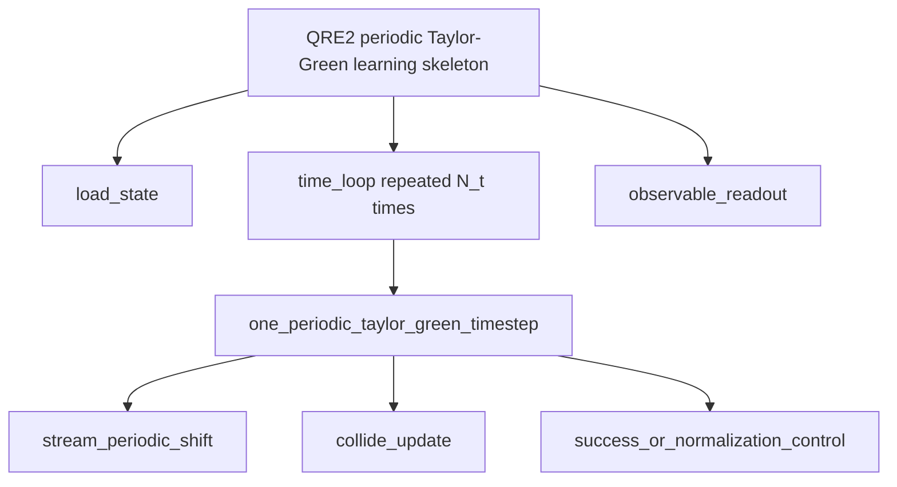

# Bartiq/QREF Route Skeleton

Date: 2026-06-04

This note records the first latest-Bartiq-only route skeleton for the periodic `QRE2` Taylor-Green path.

The goal is learning and discussion. This is not a circuit, not a resource estimate, and not a claim about `QRE2`.

## One-Sentence Summary

Bartiq let us write the route as:

```text
total cost = load once + repeat one timestep N_t times + read selected observables N_samples times
```

That is useful because it turns a vague route discussion into a visible accounting tree.

## Beginner Vocabulary

**Route**

A proposed path from a CFD problem to a quantum resource estimate. Here the route is the periodic D2Q9 Taylor-Green case tied to `QRE2`, with `QRE4`, `IO4`, `IO5`, `IO7`, and `IO8` as checks.

**Resource**

Something we want to count. Examples: logical qubits, T gates, Toffoli gates, circuit depth, samples, loading calls, or success probability.

**Symbolic resource**

A formula with variables instead of final numbers. For example:

```text
N_t * T_collide
```

means "number of timesteps times the cost of one collision update." We do not yet know the real value of `T_collide`.

**QREF**

QREF is a schema, meaning a structured data format. It lets us write a quantum algorithm as nested routines: a big routine can contain smaller routines. In our case:

```text
route
  load_state
  time_loop
    one_timestep
      stream
      collide
      success_or_normalization_control
  observable_readout
```

QREF is tracked as `PRIM15`.

**Bartiq**

Bartiq reads a QREF routine tree and aggregates local symbolic costs into a global symbolic cost. In plain terms: each child says what it costs, and Bartiq adds the costs up through the tree.

Bartiq is tracked as `PRIM14`.

**Why Not Qualtran In This Step**

Qualtran is useful when we want to ask whether a subroutine is a real quantum operation with registers, decompositions, and primitive gate counts. That is a later question.

For this step, we only need to ask whether a `QRE2` route note can become a readable symbolic accounting tree. Latest Bartiq is better for that first question because it is lighter and directly focused on symbolic resource aggregation.

## Corpus Anchors

Route and warning anchors:

- `QRE2`: bounded QLBM resource route.
- `QRE4`: realistic-flow companion to `QRE2`.
- `IO4`, `IO5`, `IO7`, `IO8`: encoding, loading, and readout warnings.

Tool anchors:

- `PRIM14`: Bartiq symbolic resource aggregation.
- `PRIM15`: QREF resource-estimation schema.
- `PRIM5`: Qualtran, deferred here because we are not building operation-level Bloqs in this step.

## What We Built

Maintained private helper:

```text
src/pq_cfd/_bartiq_qref_resources.py
```

Original scratch script:

```text
.cache/tool_trials/bartiq_qref_route_skeleton/latest_bartiq_qref_route.py
```

Command:

```powershell
uv run --isolated --with bartiq --with qref --with sympy python .cache\tool_trials\bartiq_qref_route_skeleton\latest_bartiq_qref_route.py
```

Observed versions:

```text
bartiq 0.17.0
qref 0.11.0
sympy 1.14.0
```

Bartiq and QREF are now project runtime dependencies for this private
bookkeeping path. The helper remains private and does not create a public
resource-estimation API.

## Route Tree



Read this as a bookkeeping plan:

- `load_state`: prepare or load the initial CFD state.
- `time_loop`: apply one timestep many times.
- `stream_periodic_shift`: move populations across a periodic lattice.
- `collide_update`: apply the local collision/update logic.
- `success_or_normalization_control`: placeholder for block-encoding, postselection, normalization, or amplification costs if the real route needs them.
- `observable_readout`: estimate selected observables, not the full field.

## Placeholder Formula

Bartiq produced:

```text
t_count = N_samples*T_readout_sample + N_t*(T_collide + T_stream + T_success) + T_load
```

Plain-language meaning:

- `T_load`: cost to load the initial state once.
- `N_t*T_stream`: streaming cost across all timesteps.
- `N_t*T_collide`: collision cost across all timesteps.
- `N_t*T_success`: placeholder cost for any success-probability or normalization control per timestep.
- `N_samples*T_readout_sample`: readout cost for selected-observable samples.

This formula is not from `QRE2`. It is a teaching placeholder that shows where `QRE2` formulas must eventually go.

## Example Numeric Assignment

The script also tried one fake numeric assignment just to verify that the symbolic tree evaluates:

```text
N_x = 32
N_y = 32
N_t = 10
N_samples = 1000
T_load = 10000
T_stream = 200
T_collide = 1000
T_success = 50
T_readout_sample = 25
```

Bartiq returned:

```text
lattice_populations: 9216
logical_qubits: 47
success_probability_placeholder: 0.970342987093574
state_loads: 1
t_count: 47500
samples: 1000
```

These are sanity-check numbers only. They prove the tree evaluates. They do not prove the tree is physically correct.

## What This Helps Us See

The tree makes the unresolved decisions explicit:

- What exactly is the state encoding?
- Is state loading done once, every timestep, or through an oracle/block encoding?
- What is the actual streaming primitive?
- What is the actual collision/update primitive?
- Does the route have postselection, amplitude amplification, or a success-probability penalty?
- Which observable are we reading: velocity moments, vorticity, kinetic energy, divergence, spectra, drag/lift, or something else?
- How many samples are needed for the observable tolerance?

Those questions were already present in the project. Bartiq did not solve them, but it gave us a clean place to put each answer.

## What This Does Not Do

This skeleton does not:

- implement a quantum circuit,
- implement D2Q9 LBM,
- extract actual formulas from `QRE2`,
- justify a quantum advantage,
- choose an encoding,
- choose a readout method,
- choose physical error-correction assumptions,
- add a maintained dependency.

## How The SciPy Sparse Step Connects

SciPy is not a competing quantum tool. It is for checking the classical mathematical object before we count quantum resources.

Now that the route tree has a clear `stream_periodic_shift` and `collide_update` box, the SciPy sparse helper tests the smallest sparse classical version of those boxes:

```text
tiny D2Q9 state vector
  -> sparse periodic streaming operator
  -> local collision/update operator or placeholder
  -> compare with existing run_d2q9 checks
```

That would help answer: "What exact operator are we trying to count in Bartiq?"

The implemented order is:

1. Bartiq/QREF skeleton: make the resource boxes visible.
2. SciPy sparse replay: validate the smallest classical operator boxes.
3. Return to Bartiq: replace placeholders with formulas grounded in `QRE2` and the sparse checks.

## Next Discussion Choice

My recommendation, clearly labeled as a recommendation:

Use the private sparse replay and Bartiq skeleton together to decide which placeholder formulas should be replaced with `QRE2`-grounded formulas first.

Evidence that would change this:

- If you want to learn more resource-tooling first, we can extend the Bartiq skeleton with ports/connections and a richer resource vocabulary.
- If you want to stay close to papers, we can extract the exact `QRE2` route formulas before adding more tooling.
- If you want circuit-level intuition, we can inspect qlbm or Qualtran after this, but that will be less directly tied to the current skeleton.

## Sources Checked

- [Bartiq documentation](https://psiq.github.io/bartiq/latest/)
- [Bartiq PyPI](https://pypi.org/project/bartiq/)
- [Bartiq compilation notes](https://psiq.github.io/bartiq/latest/concepts/compilation/)
- [QREF PyPI](https://pypi.org/project/qref/)
