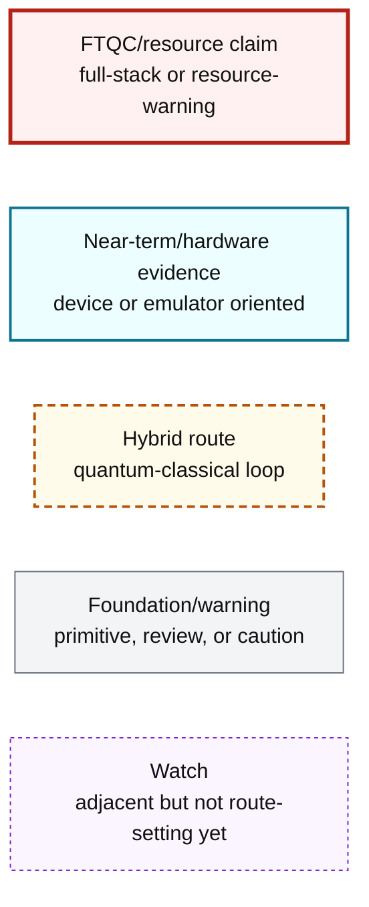
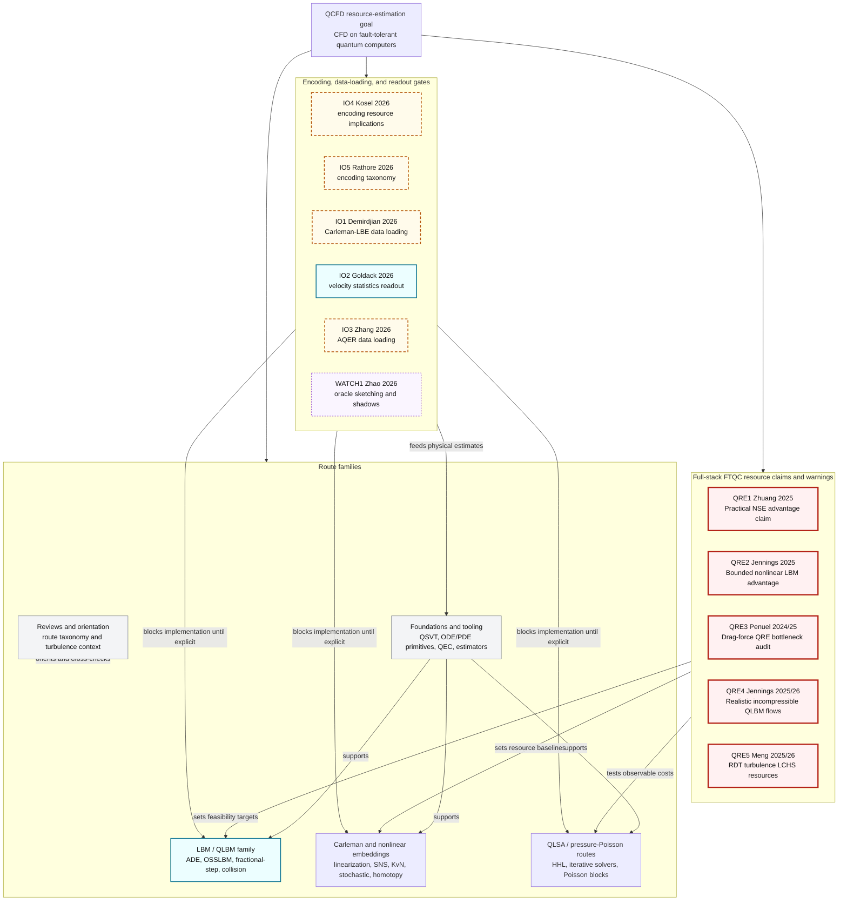
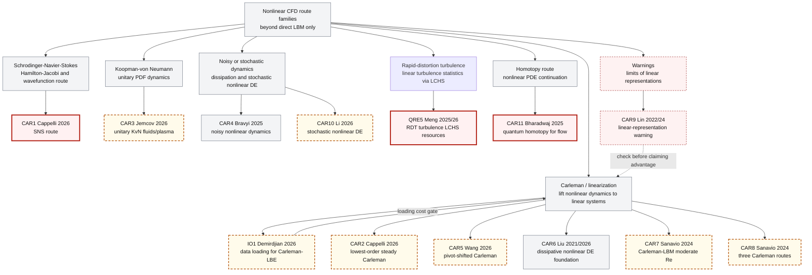
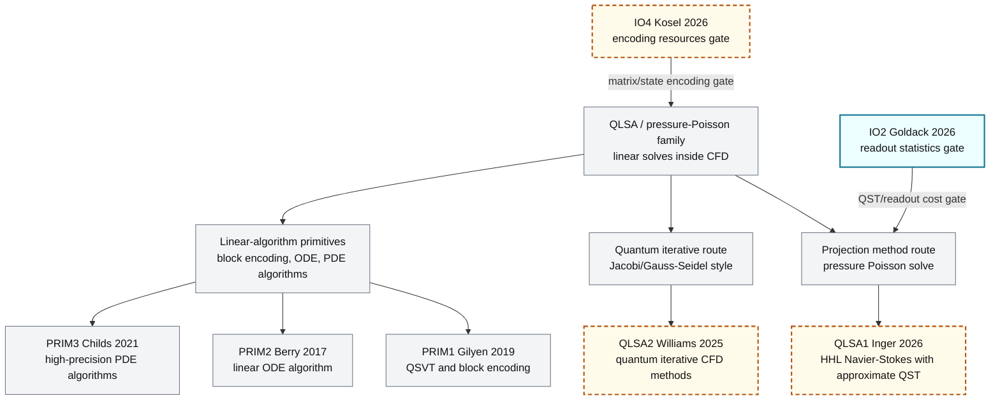
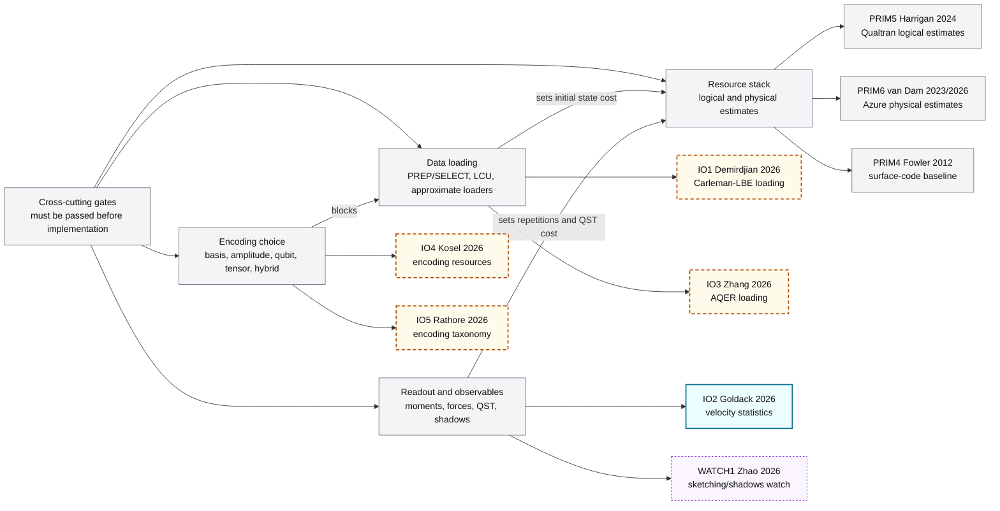

# QCFD Research Landscape Map

Latest map date: 2026-05-26.

This is the start-here wiki page for the project "Resource Estimation for Computational Fluid Dynamics on Fault-Tolerant Quantum Computer." It explains the possible QCFD route families before any implementation work begins. The bibliography remains the source of truth for paper metadata and inclusion status.

Companion documents:

- `docs/research_grounding_and_plan.md`: source-of-truth bibliography, scan protocol, paper matrix, and miss audit.
- `docs/implementation_plan.md`: dependency-ordered implementation plan and acceptance gates.
- `docs/research_mind_map.html`: optional interactive explorer for filtering paper cards.

## How To Read This Map

Start with the resource claims and warnings (`QRE1`-`QRE5`). They define what would count as a meaningful fault-tolerant result and what assumptions can make a claim collapse.

Next inspect the I/O and encoding layer (`IO4`, `IO5`, `IO1`, `IO2`, `IO3`, `WATCH1`). Every route below depends on state preparation, encoding, observable extraction, and the cost of repeated measurements.

Then choose a route family. LBM/QLBM is one family, but it is not the only one. Pressure-Poisson/QLSA, Carleman/linearization, Schrodinger-Navier-Stokes, Koopman-von Neumann, stochastic, noisy nonlinear dynamics, and homotopy routes all need separate treatment.

Finally compare FTQC readiness against near-term evidence. Hardware demos are useful for circuits, loading, and readout intuition, but they do not by themselves establish fault-tolerant resource advantage.

## Diagram Legend

## Whole QCFD Landscape

| Branch | Papers | What this branch tries to do | What we might implement | Main blocker | FTQC maturity |
| --- | --- | --- | --- | --- | --- |
| Full-stack resource claims | `QRE1`-`QRE5` | Decide whether a CFD task can survive end-to-end resource accounting. | Reproduce paper-level assumptions as structured benchmark/resource cards. | Inconsistent I/O, observable, grid, timestep, and QEC assumptions. | Highest relevance, but claims conflict and need reconciliation. |
| Encoding and readout layer | `IO4`, `IO5`, `IO1`, `IO2`, `IO3`, `WATCH1` | Make state preparation and observable extraction explicit before algorithms are trusted. | Encoding comparison matrix, data-loading cost models, readout alternatives. | Loading/readout costs can dominate solver costs. | Route-setting for FTQC, with some near-term evidence. |
| LBM / QLBM family | `LBM1`-`LBM14`, `QRE2`, `QRE4` | Express fluid update, collision, and transport in quantum-compatible forms. | D2Q9/ADE operator cards, collision alternatives, boundary cards. | Nonlinearity, irreversible collision, reinitialization, and readout. | Active and latest-heavy, but many routes are hybrid or linear. |
| Carleman and nonlinear embeddings | `CAR1`-`CAR11`, `QRE5`, `IO1` | Convert nonlinear flow dynamics into linear or unitary forms that quantum algorithms can process. | Carleman truncation experiments, SNS/KvN/stochastic/homotopy/LCHS comparison cards. | Truncation order, conditioning, data loading, and physical observables. | Mixed: promising papers, but resource assumptions are not yet unified. |
| QLSA / pressure-Poisson | `QLSA1`, `QLSA2`, `PRIM1`-`PRIM3` | Attack pressure projection or linearized CFD subproblems using QLSA-style solvers. | Pressure-Poisson benchmark card and HHL/iterative cost sketch. | Condition number, approximate QST/readout, and classical coupling. | Useful alternative route, not yet full-stack FTQC CFD. |
| Foundations and tooling | `PRIM1`-`PRIM6` | Supply the primitives and estimators needed to turn routes into resource estimates. | Qualtran/Azure estimate pipeline only after circuit assumptions are concrete. | Missing CFD-specific circuit blocks. | Required for resource estimates; not a route by itself. |
| Reviews and orientation | `SURV1`, `SURV2`, `SURV3` | Maintain taxonomy and prevent route blindness. | Use as onboarding and checklist sources. | Reviews lag fast 2026 preprints. | Foundation only. |

## LBM / QLBM Family

```mermaid
flowchart TD
    LBMROOT["LBM / QLBM family<br/>discrete velocity, streaming, collision, observables"]

    ADE["ADE and time-marching<br/>linear transport/diffusion first"]
    OSS["One-step simplified LBM<br/>OSSLBM and hybrid nonlinear loop"]
    FRAC["Fractional-step / LKS<br/>stable incompressible flow candidates"]
    COLL["Collision-operator routes<br/>LCU, denoising, irreversible effects"]
    HW["Hardware and nonuniform advection<br/>near-term demonstrations"]

    LBM4["LBM4 He 2026<br/>measurement-free ADE LBM"]
    LBM5["LBM5 Chen 2026<br/>ADE boundary circuits"]
    LBM7["LBM7 Liu 2026<br/>linear equilibrium SVD/LCU"]
    LBM2["LBM2 Bastida-Zamora 2026<br/>OSSLBM on devices"]
    LBM3["LBM3 Xiao 2026<br/>fractional-step QLBM"]
    LBM6["LBM6 Xiao 2025<br/>LKS predecessor"]
    LBM8["LBM8 Duong 2026<br/>denoising collision"]
    LBM9["LBM9 Wang 2025<br/>nonlinear ensemble QLBM"]
    LBM10["LBM10 Wawrzyniak 2025<br/>dynamic-circuit ADE"]
    LBM11["LBM11 Nagel 2026<br/>no-reinitialization ADE"]
    LBM12["LBM12 Zeng 2026<br/>linearized collision NSE"]
    LBM13["LBM13 Lee 2026<br/>QLBM-frugal resource reduction"]
    LBM14["LBM14 Lacatus 2026<br/>surrogate BGK collision"]
    LBM1["LBM1 Ray 2026<br/>trapped-ion QLBM readout"]
    QRE2["QRE2 Jennings 2025<br/>bounded nonlinear LBM resources"]
    QRE4["QRE4 Jennings 2025/26<br/>realistic incompressible flows"]

    IO4["IO4 Kosel 2026<br/>encoding gate"]
    IO5["IO5 Rathore 2026<br/>encoding gate"]
    IO2["IO2 Goldack 2026<br/>statistical readout gate"]

    LBMROOT --> ADE
    LBMROOT --> OSS
    LBMROOT --> FRAC
    LBMROOT --> COLL
    LBMROOT --> HW
    LBMROOT --> QRE2

    ADE --> LBM4
    ADE --> LBM5
    ADE --> LBM7
    ADE --> LBM10
    ADE --> LBM11
    OSS --> LBM2
    OSS --> LBM13
    FRAC --> LBM3
    FRAC --> LBM6
    COLL --> LBM8
    COLL --> LBM9
    COLL --> LBM12
    COLL --> LBM14
    HW --> LBM1
    QRE2 --> QRE4

    IO4 -->|"encoding choices constrain"| LBMROOT
    IO5 -->|"encoding taxonomy constrains"| LBMROOT
    IO2 -->|"observable extraction constrains"| LBMROOT

    classDef ftqc fill:#fff1f2,stroke:#b42318,stroke-width:3px,color:#111;
    classDef near fill:#ecfeff,stroke:#0e7490,stroke-width:2px,color:#111;
    classDef hybrid fill:#fffbeb,stroke:#b45309,stroke-width:2px,stroke-dasharray:6 4,color:#111;
    classDef foundation fill:#f3f4f6,stroke:#6b7280,stroke-width:1px,color:#111;

    class QRE2,QRE4 ftqc;
    class LBM1,IO2 near;
    class LBM2,LBM3,LBM4,LBM5,LBM6,LBM7,LBM8,LBM9,LBM10,LBM11,LBM12,LBM13,LBM14,IO4,IO5 hybrid;
    class LBMROOT,ADE,OSS,FRAC,COLL,HW foundation;
```

| Branch | Papers | What this branch tries to do | What we might implement | Main blocker | FTQC maturity |
| --- | --- | --- | --- | --- | --- |
| Bounded nonlinear LBM resources | `QRE2` Jennings | Provide an end-to-end nonlinear LBM route with bounded advantage claims. | Extract the resource template and reproduce its assumptions. | Advantage depends on tolerated error, observable choice, and end-to-end constants. | Directly FTQC-relevant. |
| Realistic incompressible QLBM flows | `QRE4` Jennings | Extend bounded QLBM to walls, inlets, outlets, forcing, cavity flow, and cylinder flow. | Add boundary/forcing benchmark cards before claiming practical relevance. | Companion result to `QRE2`; constants and physical resource assumptions remain to be reconciled. | Directly FTQC-relevant. |
| ADE/time-marching | `LBM4` He, `LBM5` Chen, `LBM7` Liu | Start with linear ADE/LBM where circuits and stability are cleaner. | Implement small ADE/LBM operator cards before nonlinear CFD. | Linear route may not transfer cleanly to Navier-Stokes. | Good stepping stone, not full CFD alone. |
| No-reinitialization ADE | `LBM10` Wawrzyniak, `LBM11` Nagel | Remove repeated state extraction/reinitialization from ADE-like QLBM loops. | Compare time-qubit, dynamic-circuit, and global-time designs on one ADE card. | Mid-circuit measurement, amplitude decay, and final readout costs need FTQC translation. | Important stepping stone. |
| OSSLBM | `LBM2` Bastida-Zamora | Simplify LBM into a one-step operator with real-device applications. | Compare OSSLBM operator decomposition against baseline D2Q9. | Hybrid nonlinear loop and missing full FTQC resource estimate. | Useful, but currently hybrid/near-term leaning. |
| Fractional-step / LKS | `LBM3` Xiao, `LBM6` Xiao | Improve incompressible-flow stability by splitting quantum and classical work. | Benchmark fractional-step assumptions against Taylor-Green and cavity cards. | Classical corrector complicates quantum advantage accounting. | Strong latest route, but hybrid. |
| Nonlinear and collision alternatives | `LBM8`, `LBM9`, `LBM12`, `LBM14` | Replace tomography/reinitialization-heavy collision handling with denoising, ensemble, linearized, or surrogate collision ideas. | Test whether collision maps preserve hydrodynamic moments in small cases. | Reference-state sensitivity, surrogate validity, linearization limits, and FTQC cost. | Important P0/P1 candidates, not yet full-stack. |
| Resource reduction and split circuits | `LBM13` Lee | Reduce gate count/depth through streamfunction-vorticity circuit splitting. | Use as a comparator for QLBM circuit-depth claims. | Tomography/readout and near-term resource metrics may not transfer directly to FTQC. | Comparator. |
| Hardware QLBM/readout | `LBM1` Ray, `IO2` Goldack | Learn from device-level QLBM and statistical readout experiments. | Use readout/reloading bottleneck and moments/structure-function observables as gates. | Near-term evidence does not equal FTQC scalability. | Hardware evidence, route-supporting. |

## Nonlinear Embeddings And Linearization Routes

| Branch | Papers | What this branch tries to do | What we might implement | Main blocker | FTQC maturity |
| --- | --- | --- | --- | --- | --- |
| Carleman-LBM and steady Carleman | `CAR2`, `CAR7`, `CAR8`, `IO1` | Lift LBM or steady fluid equations into linear systems. | Small Carleman truncation cards with explicit loading cost. | Truncation order, conditioning, and `IO1` data-loading overhead. | Important, but not solved end-to-end. |
| General Carleman foundations | `CAR5`, `CAR6`, `CAR9` | Establish what linearization can and cannot do. | Use `CAR6`/`CAR5` for formulas and `CAR9` as a warning gate. | Linear representations can hide exponential or conditioning costs. | Foundation and caution layer. |
| Schrodinger-Navier-Stokes | `CAR1` Cappelli | Reformulate Navier-Stokes through Hamilton-Jacobi/SNS structure. | Create an SNS route card and compare observables to LBM and QLSA. | Physical interpretation, boundary conditions, and resources. | P0 latest route, still needs resource accounting. |
| Koopman-von Neumann | `CAR3` Jemcov | Use unitary phase-space/PDF dynamics for fluids or plasma. | Evaluate whether PDF observables match CFD benchmark goals. | State dimension, sampling, and observables. | Promising foundation/alternative route. |
| Noisy and stochastic nonlinear dynamics | `CAR4` Bravyi, `CAR10` Li | Treat dissipation/noise/stochastic nonlinear DEs as the core route. | Compare stochastic/noisy assumptions against deterministic CFD cards. | Mapping Navier-Stokes observables and FTQC noise assumptions. | Useful alternative, not the default route yet. |
| Rapid-distortion turbulence / LCHS | `QRE5` Meng | Use linear rapid-distortion turbulence as an end-to-end turbulence-statistics target. | Add Reynolds-stress and velocity-spectrum cards with explicit state-preparation/readout costs. | It is a linear turbulence model, not a full nonlinear turbulence solver. | P0 latest resource route. |
| Homotopy nonlinear PDE route | `CAR11` Bharadwaj | Solve nonlinear PDEs and flow by continuation/homotopy. | Add a homotopy benchmark card and compare against Carleman/QLBM. | Convergence, oracle construction, and resource estimates. | P0 latest route to examine early. |

## QLSA And Pressure-Poisson Routes

| Branch | Papers | What this branch tries to do | What we might implement | Main blocker | FTQC maturity |
| --- | --- | --- | --- | --- | --- |
| HHL / pressure-Poisson | `QLSA1`, `PRIM1`, `PRIM3`, `IO2`, `IO4` | Use HHL/QLSA for incompressible projection or pressure solve. | Pressure-Poisson card with approximate QST/readout assumptions explicit. | Condition number, approximate QST, and coupling back to velocity fields. | Useful alternative, not full-stack yet. |
| Quantum iterative CFD | `QLSA2`, `PRIM1` | Replace or accelerate iterative linear-solver substeps. | Compare Jacobi/Gauss-Seidel quantum variants to classical baselines. | Iteration count, state access, and readout. | P2 route; keep as comparator. |
| Linear primitives | `PRIM1`, `PRIM2`, `PRIM3` | Provide the mathematical substrate for linear systems and PDEs. | Use only after a concrete CFD operator is defined. | Not CFD-specific and can hide model-loading costs. | Foundation only. |

## Encoding, Readout, And Resource Gates

| Gate | Papers | What this gate asks | What we might implement | Main blocker | FTQC maturity |
| --- | --- | --- | --- | --- | --- |
| Encoding | `IO4`, `IO5` | How is the CFD state represented, and what does that do to resources? | Encoding decision table for every route card. | A route can look efficient only because encoding was ignored. | P0, route-setting. |
| Data loading | `IO1`, `IO3`, `WATCH1` | How are initial, coefficient, and operator data loaded? | PREP/SELECT and AQER cost sketches. | Loading can dominate or eliminate advantage. | P0/P1 for core loading, Watch for shadows/sketching. |
| Readout | `IO2`, `QRE3`, `QLSA1`, `WATCH1` | Which observable is extracted, at what precision, and how often? | Drag, velocity moments, structure functions, pressure/QST cards. | Full-state readout is usually fatal; selected observables must be explicit. | P0 gate. |
| Resource-estimation stack | `PRIM4`, `PRIM5`, `PRIM6`, `QRE1`-`QRE3` | How do logical gates become physical qubits and runtime? | Qualtran logical model plus Azure physical model after circuit assumptions exist. | Tool assumptions, QEC choices, and custom CFD blocks. | Required for final project output. |

## FTQC Versus Near-Term And Hybrid Maturity

| Maturity bucket | Papers | What it means for this project |
| --- | --- | --- |
| FTQC/resource route-setting | `QRE1`, `QRE2`, `QRE3`, `QRE4`, `QRE5`, `CAR1`, `CAR11` | Read early. These can change route priority or feasibility claims. |
| Hybrid / algorithm proposal | `LBM2`, `LBM3`, `LBM4`, `LBM5`, `LBM6`, `LBM7`, `LBM8`, `LBM9`, `LBM10`, `LBM11`, `LBM12`, `LBM13`, `LBM14`, `CAR2`, `CAR3`, `CAR5`, `CAR7`, `CAR8`, `CAR10`, `QLSA1`, `QLSA2`, `IO1`, `IO3`, `IO4`, `IO5` | Useful for route cards, but each needs explicit gates before implementation. |
| Near-term / hardware evidence | `LBM1`, `IO2` | Use for circuit/readout lessons and bottlenecks, not as direct FTQC proof. |
| Foundation / warning | `CAR4`, `CAR6`, `CAR9`, `PRIM1`-`PRIM6`, `SURV1`-`SURV3` | Read when a newer paper depends on the primitive or warning. |
| Watch | `WATCH1` | Track for I/O ideas; do not build around it yet. |

## Route Selection Rules

| Decision | Default rule | Papers that force the rule |
| --- | --- | --- |
| Do not implement a solver route until the observable is named. | The benchmark card must name density, velocity moment, drag, pressure, vorticity, structure function, or another measurable target. | `QRE3`, `IO2`, `QLSA1`, `WATCH1` |
| Do not trust algorithmic speedup without encoding and loading cost. | Every route card must specify encoding, state preparation, operator data, and reloading assumptions. | `IO4`, `IO5`, `IO1`, `IO3`, `QRE1` |
| Treat hardware demos as evidence, not final resource estimates. | Near-term results inform circuit shape and noise/readout risks, then get translated into FTQC assumptions separately. | `LBM1`, `LBM2`, `IO2`, `WATCH2`, `PRIM5`, `PRIM6` |
| Compare multiple nonlinear strategies before choosing LBM by default. | LBM is central, but SNS, Carleman, KvN, stochastic, noisy, homotopy, LCHS/turbulence, and QLSA routes must be represented. | `CAR1`, `CAR2`, `CAR3`, `CAR4`, `CAR10`, `CAR11`, `QRE5`, `QLSA1`, `QLSA2` |
| Use multi-label filtering, not ID prefixes, for paper selection. | A paper such as `QRE2` is also `LBM`, `FTQC`, `Resource-Estimation`, `Readout`, and `Observable-Selection`; route cards must copy all relevant labels. | `docs/research_grounding_and_plan.md` |
| Older primitives stay only when newer papers depend on them. | Foundations are not reading priorities unless needed for a current route card. | `PRIM1`, `PRIM2`, `PRIM3`, `PRIM4`, `CAR6`, `CAR9` |

## Known Gaps And Update Protocol

Known gaps to keep visible:

- Direct quantum SPH, meshfree, and vortex-method routes are not yet represented as core branches.
- Quantum machine-learning surrogates for CFD are excluded unless they provide explicit FTQC resource estimates or solver primitives.
- Quantum sensing or experimental fluid-measurement papers are adjacent unless they affect readout assumptions for simulated velocity fields.
- Turbulence-specific observable papers now start with `QRE5`; they still need separate review if the benchmark moves beyond rapid distortion theory, Taylor-Green, cavity, Poiseuille, Couette, drag, cylinder, or pressure-Poisson cards.
- New 2026 papers can change route priority quickly; this page should be treated as a dated map, not a permanent taxonomy.

Update protocol:

1. Add any new paper to `docs/research_grounding_and_plan.md` first with ID, date/revision, priority, maturity, route, extraction, risk, and inclusion reason.
2. Assign all relevant multi-label tags in the Paper Multi-Label Matrix, including formulation, method, I/O, resource/hardware, benchmark/observable, and status labels.
3. If it is `P0` or `P1`, add it to this landscape map in both a diagram and a branch/maturity table.
4. If it changes implementation order, update `docs/implementation_plan.md`.
5. Record why it was found or missed in the bibliography miss-audit notes. Search terms should include the route term, CFD term, and bottleneck term, for example `homotopy Navier-Stokes quantum`, `stochastic nonlinear differential equations quantum fluid`, `encoding quantum CFD`, `readout lattice Boltzmann quantum`, `Koopman von Neumann fluid quantum`, and `pressure Poisson HHL Navier-Stokes`.
